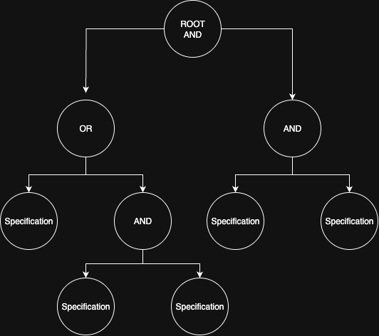

# Dynaspec

Dynaspec is a Go library for defining, storing, and evaluating dynamic logical trees. It is designed to let you model complex business logic, decision trees, or rule engines that can be configured and persisted in a database.

## Features

- **Dynamic Tree Structure:** Define logical operations (AND, OR, NAND, NOR, XOR, XNOR) as tree nodes.
- **Pluggable Operators:** Easily register new logical operators.
- **Persistence Layer:** MySQL-backed storage of trees and results.
- **Flexible Evaluation:** Trees can be evaluated against arbitrary input data at runtime.

## Project Structure

- `tree/` — definitions for trees, nodes, and operators.
- `gates/` — logical gate implementations (AND, OR, etc.).
- `accessor/` — database access code.
- `registry.go` — global registry for operators and specifications.

## Tree

[](./diagram.png)

A dynamic specification flow represents a combination of specifications connected by logical gates (e.g., AND, OR, etc.), forming a tree-like structure.

In this package:

- Each node has a operator which is either a gate or a condition.

	- Gates can have multiple child nodes.

	- Conditions are leaf nodes — they do not have children.

	- They defines the actual specification logic and can act as either a gate or a condition.

- Each node contains an Operand:

	- The Operand is a string value. Its interpretation is left to the Operator, which parses it as needed.


All Operators (specifications) are managed through a global registry. Therefore, make sure to register all Operators before working with trees:

```go
dynaspec.Register()
```

Here’s a refined and consistent version of that section, matching the tone and clarity of the previous rewrite:

### Tree Structure

A **Tree** represents the full specification flow and acts as an entry point to the root node.
It also holds metadata that describes its lifecycle and purpose.

A `Tree` contains the following fields:

* **Start**, **End** — define the time range during which the tree is considered valid for traversal.
* **Active** — a flag indicating whether the tree is currently active.
* **Name** — a descriptive name that can be used for filtering or sorting.
* **Result** — the final computed value associated with the tree when it is valid.
* **Root** — a reference to the root **Node**, from which traversal begins.


## Accessor

Accessors are abstractions that handle saving, loading, and managing tree structures. They provide persistence for trees. Below is a sample schema to represent an entire tree structure in a relational database:

```sql
CREATE TABLE trees (
  id BIGINT UNSIGNED AUTO_INCREMENT PRIMARY KEY,
  created_at TIMESTAMP NOT NULL DEFAULT CURRENT_TIMESTAMP,
  active BOOLEAN NOT NULL DEFAULT TRUE,
  name VARCHAR(255) NOT NULL,
  start_time TIMESTAMP NULL,
  end_time TIMESTAMP NULL,
  result JSON NOT NULL,
  structure JSON NOT NULL, -- stores the Node tree structure
  INDEX idx_trees_created_at (created_at),
  INDEX idx_trees_active (active)
);
```

#### Benefits

* **Fast reads** for the entire tree.
* **No recursive joins** or closure tables required.
* **Simple caching** in Redis or the application layer.
* Ideal for cases where trees are **constructed once** and **read frequently**.

#### Trade-offs

* Querying specific nodes with SQL is **not efficient**.
* **Full JSON updates** are required when a node changes.

In this design, trees are **deleted and re-inserted** on updates, so updating the JSON blob is not an issue.
Direct node querying is unnecessary since all important data and states are available in the `trees` table.
This approach provides **excellent read performance** and **cacheability**, which aligns with the main use case.

> **All fields in the Tree and Node structs are exported to support custom persistence implementations**


## Example Use Case

You might use Dynaspec to represent workflows, access control policies, or complex feature flag evaluation in your application—anywhere you need logic that's configurable at runtime.

> For detailed API documentation, see [docs.go](./docs.go).

```go

import (
	"context"
	"database/sql"
	"fmt"
	"log"
	"strconv"
	"strings"

	acc "dynaspec/accessor/mysql"
	"dynaspec/tree"
)

type CustomerIdMustBeInCondition struct{}
type QuantityMustBeGreaterThanCondition struct{}
type ProductIdMustBeInCondition struct{}

func (c CustomerIdMustBeInCondition) IsSatisfied(n tree.Node, value interface{}) bool {
	expectedIds := strings.Split(n.Operand, ",")

	for _, op := range expectedIds {
		expected, err := strconv.Atoi(strings.TrimSpace(op))
		if err != nil {
			continue
		}
		if value.(Order).CustomerID == uint(expected) {
			return true
		}
	}

	return false
}

func (c QuantityMustBeGreaterThanCondition) IsSatisfied(n tree.Node, value interface{}) bool {
	expected, err := strconv.Atoi(n.Operand)
	if err != nil {
		return false
	}
	return value.(Order).Quantity > uint(expected)
}

func (c ProductIdMustBeInCondition) IsSatisfied(n tree.Node, value interface{}) bool {
	expectedIds := strings.Split(n.Operand, ",")
	for _, op := range expectedIds {
		expected, err := strconv.Atoi(strings.TrimSpace(op))
		if err != nil {
			continue
		}
		if value.(Order).ProductID == uint(expected) {
			return true
		}
	}
	return false
}

type Order struct {
	CustomerID uint
	ProductID  uint
	Quantity   uint
}

func main() {
	Register(
		Use("customerIdMustBeIn", CustomerIdMustBeInCondition{}),
		Use("quantityMustBeGreaterThan", QuantityMustBeGreaterThanCondition{}),
		Use("productIdMustBeIn", ProductIdMustBeInCondition{}))

	db, err := sql.Open("postgres", "user=postgres password=postgres dbname=postgres sslmode=disable")
	if err != nil {
		log.Fatal(err)
	}
	defer db.Close()

	accessor := acc.New(db)
	// get the tree from the accessor
	tree, err := accessor.Get(context.Background(), 1)
	if err != nil {
		log.Fatal(err)
	}

	order := Order{
		CustomerID: 1234,
		ProductID:  1234,
		Quantity:   1,
	}
	if tree.Traverse(order) {
		fmt.Printf("Tree is satisfied. [result: %v]\n", tree.Result)
	} else {
		fmt.Println("Tree is not satisfied")
	}
}

```

## Installation

```bash
go get github.com/yourusername/dynaspec
```

## Contributing

Pull requests are welcome! Please open an issue or discussion for ideas and improvements.

## License

MIT License
